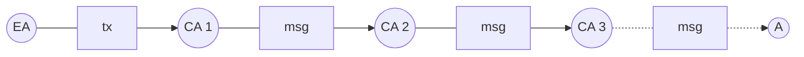
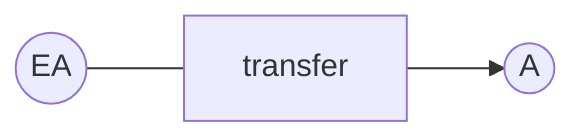
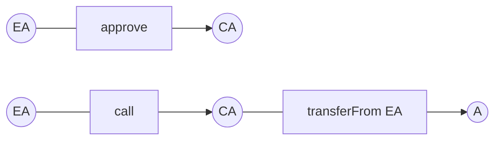

# Service-Friendly Token Standard

## Simple Summary

<!--"If you can't explain it simply, you don't understand it well enough." Provide a simplified and layman-accessible explanation of the EIP.-->
<!-- A standard interface for service-friendly tokens, which aims for a grounded代幣化environment for business. -->

This Token standard is designed to allow Tokens to interact with service-based smart contracts and off-chain services seamlessly and without friction, providing a friendly environment for the Tokens.

## Abstract

<!--A short (~200 word) description of the technical issue being addressed.-->

Originally designed to be a crowdfunding tool, Tokens now have a painful period of transition to being a Utility Token, to provide their service to the token holders. Many projects and companies lack sufficient Smart Contract functionalities in their Tokens, which makes it difficult to support the fundamentals of their business venture and to apply it to real-world services and products.

The following interface designs are based on the fundamental features and aspects of a **Robust Tokenisation** that businesses need. This including removing the difficulties of secure bindings among smart contracts and on-chains and off-chains integration. We, FundersToken based on our experience, understanding of the Token Standards that are available in the market, FundersToken have made several improvements on the Token Standards aiming to build a Native Token Environment, a friendly environment for Tokens.

FundersToken have also developed a **Token transfer relay**, which simulates blockchains in the form of smart contracts for the Tokens, and releases end-users from the need and limitation of only using Ether as transaction fee (gas fee) when making a token transfer.

## Motivation

<!--The motivation is critical for EIPs that want to change the Ethereum protocol. It should clearly explain why the existing protocol specification is inadequate to address the problem that the EIP solves. EIP submissions without sufficient motivation may be rejected outright.-->

We categorise this interface standard to the following :

1.  [The improvements made on ERC-20](#erc-20-補強)
2.  [The improvements made to make a Token service-friendly](#service-friendly-服務友善化-補強)
3.  [The improvements for Robust Tokenisation](#tokenisation-代幣化-補強)

As the most basic and most common way of controlling and storing Tokens, ERC-20 has proved to be a feasible and viable direction, however due to different implementations, such as gas consumption and mathematical safety of execution, many Tokens have suffered abuse and denial-of-service that led to financial loss.

We have make optimisation and made mathematical checks for the implementation of `transfer` and `approve`, and how to store `balance` and `allowance` efficiently.

---

To define a service-friendly environment, we must first identify the design goals of the payment flow and the smart contracts on the Ethereum Blockchain.

The payment flow of an Ethereum transaction :



The payment flow of a ERC20 token transaction :



or



> EA represents External Account  
> CA represents Contract Account  
>  A represents EA and CA

Most of the current Token standards have difficulties to compose multiple continuous processes in one Ethereum transaction, in additional the transaction must be triggered after the process of `approve` is done, this process is also in risk to be attacked by other smart contracts, by deliberately consuming the `allowance` more than the intended consumption.

From the statement above, we can see the Tokens are less direct and dynamic compared to Ether. Since Tokens are driven by smart contracts, Tokens must follow the execution process of the Ethereum transaction, which means the recipient address of a Token transfer transaction is the Token smart contract instead of `to` in `transfer`. The process and implementation of the Token `transfer` is not intuitive as Ether's transfer.

And because the Token ledger is within the smart contract of the token, any mutation to the ledger (the balance and the allowance) or the logics must be designed and wrapped in the Token smart contract. Otherwise, the Token smart contract has to authorize or approve external smart contracts to extend the logic that is related to the ledger. But the former option slows down the development cycle, the latter option will increase the execution cost and security risks.

We had experienced the inconvenience during the development of smart contract module and providing modularisation services. Our goal is to make the Token payment flow described  below :

```
(EA) --[transfer and call]-> (CA 1)
     --[transfer and call]-> (CA 2)
     --[transfer and call]-> (CA 3)
     ...
     ...
     --[transfer and call]-> (A)
```

In short, we hope to make payment flow and execution flow of the Tokens are as natural as Ether's, and make the services provided by the Tokens more direct, intuitive and easier to develop, instead of setting back the business due to the inconvenience of ERC-20 Token standard.

To achieve this goal, we have improved the `transferAndCall` in ERC-223 and ERC-827, and ensure the `receiverContract` (the Service smart contract) always gets the real `value` and the real `from` (the origin of the Token transfer), and make the `receiverContract` unable to attack the `from`. We will explain this in detail later.

Moreover, what was mentioned above is not only to increase the consistency and the linking flexibility among the service-based smart contracts, making the business logic and the payment flow more modularised and secured, but to make on-chain-off-chain integrations more complete and more consistent, reducing the needs of status checking or multi-phase commit development, encouraging more developers' adoption.

---

As the improvement made for tokenisation, it is based after our service-friendly Token, and we took a step further to conduct important features for businesses such as CRM functionality and Token relay to achieve a De-Ether environment.

The important feature for CRM is compacting multiple Token transfers and making the process as light and predictable as possible, which allows businesses to have more flexibility for CRM applications.

The Token relay is to remove the biggest technical barrier, which is the need for end-users to pay Ether in a Token transfer as the transaction fee.  
If the situation is in a context of  that Ethereum is a decentralised computing platform and cash platform, and to execute smart contracts, the end-users must pay Ether to stablise the Ethereum network and incentivise the miners to sustain the network, then it's very rational and acceptable to everyone.  
But if it is in the context of Tokens, it becomes illogical and cloggy.

The idea of "No Ether, No Token usages" obstructs the utility of tokenisation.  
So we have implemented a feature that allows the origin of a token transfer to sign a specific **Token transfer request**, and the **Relayers** check its transfer fee (in Token) and the signature then the Relayers relay the request by sending the request to the Token smart contract, which also means the Relayers pay the ETH transaction gas for the request.  
Then the Token smart contract checks the relayed transfers and avoid any attack among transfer origin, relayers and the receivers.

Further details are in the next section.

## Specification

<!--The technical specification should describe the syntax and semantics of any new feature. The specification should be detailed enough to allow competing, interoperable implementations for any of the current Ethereum platforms (go-ethereum, parity, cpp-ethereum, ethereumj, ethereumjs, and [others](https://github.com/ethereum/wiki/wiki/Clients)).-->

### The improvements to ERC-20

Index:

1. [Extension to `address` and `uint256`]
2. [Immutable Token basic info]
3. [Optimised Token holders' storage]
4. [Mutable Token basic info]
5. [Events of the Token]
6. [Operation functions of the Token]
7. [More secure Token]

---

#### Extension to `address` and `uint256`:

We extended the methods in type `address` and `uint256`

<details><summary>AddressExtension Soucre Code</summary>

```
pragma solidity ^0.4.24;
pragma experimental "v0.5.0";
pragma experimental ABIEncoderV2;

library AddressExtension {

  function isValid(address _address) internal pure returns (bool) {
    return 0 != _address;
  }

  function isAccount(address _address) internal view returns (bool result) {
    assembly {
      result := iszero(extcodesize(_address))
    }
  }

  function toBytes(address _address) internal pure returns (bytes b) {
   assembly {
      let m := mload(0x40)
      mstore(add(m, 20), xor(0x140000000000000000000000000000000000000000, _address))
      mstore(0x40, add(m, 52))
      b := m
    }
  }
}
```

</details>

<details><summary>Math Soucre Code</summary>

```
pragma solidity ^0.4.24;
pragma experimental "v0.5.0";
pragma experimental ABIEncoderV2;

library Math {

  struct Fraction {
    uint256 numerator;
    uint256 denominator;
  }

  function isPositive(Fraction memory fraction) internal pure returns (bool) {
    return fraction.numerator > 0 && fraction.denominator > 0;
  }

  function mul(uint256 a, uint256 b) internal pure returns (uint256 r) {
    r = a * b;
    require((a == 0) || (r / a == b));
  }

  function div(uint256 a, uint256 b) internal pure returns (uint256 r) {
    r = a / b;
  }

  function sub(uint256 a, uint256 b) internal pure returns (uint256 r) {
    require((r = a - b) <= a);
  }

  function add(uint256 a, uint256 b) internal pure returns (uint256 r) {
    require((r = a + b) >= a);
  }

  function min(uint256 x, uint256 y) internal pure returns (uint256 r) {
    return x <= y ? x : y;
  }

  function max(uint256 x, uint256 y) internal pure returns (uint256 r) {
    return x >= y ? x : y;
  }

  function mulDiv(uint256 value, uint256 m, uint256 d) internal pure returns (uint256 r) {
    // try mul
    r = value * m;
    if (r / value == m) {
      // if mul not overflow
      r /= d;
    } else {
      // else div first
      r = mul(value / d, m);
    }
  }

  function mulDivCeil(uint256 value, uint256 m, uint256 d) internal pure returns (uint256 r) {
    // try mul
    r = value * m;
    if (r / value == m) {
      // mul not overflow
      if (r % d == 0) {
        r /= d;
      } else {
        r = (r / d) + 1;
      }
    } else {
      // mul overflow then div first
      r = mul(value / d, m);
      if (value % d != 0) {
        r += 1;
      }
    }
  }

  function mul(uint256 x, Fraction memory f) internal pure returns (uint256) {
    return mulDiv(x, f.numerator, f.denominator);
  }

  function mulCeil(uint256 x, Fraction memory f) internal pure returns (uint256) {
    return mulDivCeil(x, f.numerator, f.denominator);
  }

  function div(uint256 x, Fraction memory f) internal pure returns (uint256) {
    return mulDiv(x, f.denominator, f.numerator);
  }

  function divCeil(uint256 x, Fraction memory f) internal pure returns (uint256) {
    return mulDivCeil(x, f.denominator, f.numerator);
  }

  function mul(Fraction memory x, Fraction memory y) internal pure returns (Math.Fraction) {
    return Math.Fraction({
      numerator: mul(x.numerator, y.numerator),
      denominator: mul(x.denominator, y.denominator)
    });
  }
}
```

</details>

---

#### Immutable Token basic info:

- `string name` The Token name
- `string symbol` The Token symbol
- `uint8 decimals` The decimals of stored number in ledger 

```
string public constant name;
string public constant symbol;
uint8 public constant decimals;
```

---

#### Optimised Token holders' storage:

In `Account`,

- `uint256 balance` is the balance of the Token holder
- `uint256 nonce` is the transfer count of the Token holder, avoiding double spending, but only used in Token relay mode, the details are in [Tokenisation section]().
- `mapping (address => Instrument) instruments` is the storage stores the data among the Token holders.

In `Instrument` ,

- `uint256 allowance` is the allowance for other users approved by the token holder

_`DirectDebit directDebit` is the direct debit info of the token holder, but this part is more like an example to design a shared data structure among the token holders. The Service-Friendly Token Standard extension and the token implementation of by FundersToken contain this structure_

```
struct Instrument {
  uint256 allowance;
  DirectDebit directDebit;
}

struct Account {
  uint256 balance;
  uint256 nonce;
  mapping (address => Instrument) instruments;
}

mapping(address => Account) internal accounts;
```

---

#### Mutable Token basic info:

- `totalSupply()` get the totalSupply of the token
- `balanceOf(address)` get the balance of the token holder
- `allowance(address,address)` get the allowance of the approved user
- `address issuer` 為代幣發行者位址，這雖然非 ERC-20 標準之要求，而於諸多操作中需要此資訊之檢查

```
function totalSupply () public view returns (uint256);

function balanceOf(address owner) public view returns (uint256) {
  return accounts[owner].balance;
}

function allowance(address owner, address spender) public view returns (uint256) {
  return accounts[owner].instruments[spender].allowance;
}

address public issuer;
```

---

#### 代幣事件:

- `Transfer(address,address,uint256)` 為任何一個代幣數字變動時應發射的事件
- `Approval(address,address,uint256)` 為任何一次的代幣擁有者允許其他帳戶使用時發射的事件

```
event Transfer(address indexed from, address indexed to, uint256 value);
event Approval(address indexed owner, address indexed spender, uint256 value);
```

其中，因為支持絕大部分的區塊鏈瀏覽器服務，如 Etherscan ，在代幣一開始被建構時，發射事件，表示初始代幣發行。

```
emit Transfer(address(0), <tokenIssuer>, <totalSupply>);
```

---

#### 代幣的操作相關函數:

以下與 ERC-20 的介面標準是一樣的，但與數學相關的操作，特別是減法的部份就會以 `Math` 的延伸方法進行操作，並搭配讀取 `accounts` 映射表來降低映射表操作次數

```
function transfer(address to, uint256 value) public returns (bool) {
  Account storage senderAccount = accounts[msg.sender];

  // guarded by Math
  senderAccount.balance = senderAccount.balance.sub(value);
  // guarded by totalSupply
  accounts[to].balance += value;

  emit Transfer(msg.sender, to, value);

  return true;
}

function transferFrom(address from, address to, uint256 value) public returns(bool) {
  Account storage fromAccount = accounts[from];
  Instrument storage senderInstrument = fromAccount.instruments[msg.sender];

  // guarded by Math
  fromAccount.balance = fromAccount.balance.sub(value);
  // guarded by Math
  senderInstrument.allowance = senderInstrument.allowance.sub(value);
  // guarded by totalSupply
  accounts[to].balance += value;

  emit Transfer(from, to, value);

  return true;
}

function approve(address spender, uint256 value) public returns (bool) {
  Instrument storage spenderInstrument = accounts[msg.sender].instruments[spender];

  if (erc20ApproveChecking) {
    require((value == 0) || (spenderInstrument.allowance == 0));
  }

  emit Approval(
    msg.sender,
    spender,
    spenderInstrument.allowance = value
  );

  return true;
}
```

`approve(address,uint256)` 中的 `erc20ApproveChecking` 請見下一個部份。

而當 `erc20ApproveChecking` 為 `true` 時，此 `approve(address,uint256)` 中會額外做檢查，檢查 `spender` 目前的 `allowance` 是否為 0，以防 spender 插隊攻擊代幣擁有者。

---

#### 增強安全用代幣資訊、操作:

- `bool erc20ApproveChecking` 為一個狀態值紀錄是否要開啟更安全的 `approve` 相關執行檢查，預設為 `false`，只有 `issuer` 才能更動
- `SetERC20ApproveChecking(bool)` 為 `erc20ApproveChecking` 改變時會發射的事件，需要透過 `setERC20ApproveChecking(bool)` 引發
- `approve(address,uint256,uint256)` 會要求代幣擁有者輸入預期的 `allowance`，通過驗證才能繼續改變 `allowance`
- `increaseAllowance(address,uint256)` 可直接增加 `allowance`
- `decreaseAllowance(address,uint256,bool)` 可直接減少 `allowance`，而當 `strict` 為 `true` 時，會用 `Math` 進行減法檢查
- `spendableAllowance(address,address)` 可直接得知被允許之帳戶可以實際上消耗多少額度

<details><summary>Secure ERC20 Approve Checking Soucre Code</summary>

```
bool public erc20ApproveChecking;

event SetERC20ApproveChecking(bool approveChecking);

function setERC20ApproveChecking(bool approveChecking) public {
  require(msg.sender == issuer);
  emit SetERC20ApproveChecking(erc20ApproveChecking = approveChecking);
}

function approve(address spender, uint256 expectedValue, uint256 newValue) public returns (bool) {
  Instrument storage spenderInstrument = accounts[msg.sender].instruments[spender];
  require(spenderInstrument.allowance == expectedValue);

  emit Approval(
    msg.sender,
    spender,
    spenderInstrument.allowance = newValue
  );

  return true;
}

function increaseAllowance(address spender, uint256 value) public returns (bool) {
  Instrument storage spenderInstrument = accounts[msg.sender].instruments[spender];

  emit Approval(
    msg.sender,
    spender,
    // guarded by Math
    spenderInstrument.allowance = spenderInstrument.allowance.add(value)
  );

  return true;
}

function decreaseAllowance(address spender, uint256 value, bool strict) public returns (bool) {
  Instrument storage spenderInstrument = accounts[msg.sender].instruments[spender];

  uint256 currentValue = spenderInstrument.allowance;
  uint256 newValue;
  if (strict) {
    // guarded by Math
    newValue = currentValue.sub(value);
  } else if (value < currentValue) {
    // guarded by if
    newValue = currentValue - value;
  }

  emit Approval(
    msg.sender,
    spender,
    spenderInstrument.allowance = newValue
  );

  return true;
}

function spendableAllowance(address owner, address spender) public view returns (uint256) {
  Account storage ownerAccount = accounts[owner];
  return Math.min(
    ownerAccount.instruments[spender].allowance,
    ownerAccount.balance
  );
}
```

</details>

### Service-Friendly (服務友善化) 補強

索引:

1. [Transfer and call (傳送呼叫)](#transfer-and-call-傳送呼叫)

---

#### Transfer and call (傳送呼叫):

為了讓傳送代幣與呼叫接收者智能合約 (receiverContract) 是一氣呵成，能讓這些呼叫可以連續地一個串一個串下去，並且同時也讓接收者智能合約可以得到真正的 `value` 與 `msg.sender`，對於參數的檢查與覆蓋就會變得非常嚴格

在 `transferAndCall(address,uint256,bytes)` 的參數中

- `address to` 為接收者智能合約的位址
- `uint256 value` 為代幣傳送量，與 `transfer` 的一樣意義
- `bytes data` 為後續所有連續動作都需要的參數資料，與 `to.call(data)` 搭配使用，`data` 其中應內含 `signature`、 `value` 與 `msg.sender`

並且因為 `data` 最少要包含要傳遞給接收者智能合約的資料，故長度至少為 **4 bytes signature + 32 bytes value + 32 bytes sender** = **68 bytes**

也會進行下列檢查

- 禁止 `to` 為合約本身
- 檢查 `data` 的長度需大於等於 68 bytes
- 檢查確定代幣傳送已經完成

以及對於 data 的前兩個參數進行強制覆蓋，讓 `data` 中必定是

```
[4 bytes signature][32 bytes value][32 bytes msg.sender][其他原先的資料們]
```

故意讓 `uint256 value` 先而 `address sender` (`address from`) 後的原因為，不與 `address to` + `uint256 value` 的組合順序搞混

```
// Token Contract (TokenA, decimals = 18)

function transferAndCall(
  address to,
  uint256 value,
  bytes data
)
  public
  payable
  returns (bool)
{
  require(
    to != address(this) &&
    data.length >= 68 &&
    transfer(to, value)
  );
  assembly {
      mstore(add(data, 36), value)  // 32 (length) + 4 (signature)
      mstore(add(data, 68), caller) // 32 (length) + 4 (signature) + 32 (1st arg)
  }
  require(to.call.value(msg.value)(data));
  return true;
}
```

以及，接收者智能合約的函數就需要配合前兩個參數為 `uint256 value` 以及 `address from`  
範例:

```
// Receiver Contract (Vendor machine, sells TokenB)

function purchase(
  uint256 value,
  address from
)
  public
  payable
  returns (bool)
{
  require(msg.sender == address(TokenA));

  return TokenB.transfer(from, calculateAmount(value));
}
```

所以要使終端使用者可以用 100 TokenA 購買 TokenB 時，只要能編碼下列 tx input，簽署並送出即可

假設 `msg.sender` (`from`) 為 `0x83b21dbd0e60b9709d647de183f5ae0c31b54c2a`，也假設接收者智能合約 (VendorMachine) 為 `0x1234567890123456789012345678901234567890`

```
transferAndCall(
  "0x1234567890123456789012345678901234567890",
  "100000000000000000000",
  "0xae77c23700000000000000000000000083b21dbd0e60b9709d647de183f5ae0c31b54c2a0000000000000000000000000000000000000000000000056bc75e2d63100000");
```

或者擺隨意的 bytes 在後面，但 signature 不能影響到 ( `"0x" + keccak256("purchase(uint256,address)")[0~7]` = `0xae77c237` )

```
transferAndCall(
  "0x1234567890123456789012345678901234567890",
  "100000000000000000000",
  "0xae77c23700000000000000000000000000000000000000000000000000000000000000000000000000000000000000000000000000000000000000000000000000000001");
```

### Tokenisation (代幣化) 補強

索引:

1. [一次性多個傳送代幣](#一次性多個傳送代幣)
2. [代幣傳送委派、代幣轉發](#代幣傳送委派代幣轉發)

---

#### 一次性多個傳送代幣

- `transfer(uint256[])` 為一次性傳送代幣給多個對象時所作的操作
- `transfer(uint256[])` 中的參數 `uint256[] data` 內容是各元素為 **20 bytes receiverAddress + 12 bytes value** 的 `uint256` 數字的不限長度陣列

為減少所需要帶上的參數，我們將接收者位址 (receviers) 跟 代幣傳送量 (values) 合在了一起，在一個 32 bytes 的 `uint256` 數字裡面就能紀錄接收者地址與代幣傳送量

只不過 12 bytes 能紀錄的量對於 decimals = 18 的代幣而言，就不能傳太過於大的數字了，但至少對每個接收者也有 79,228,162,514.264337593543950335 個代幣可傳 (已經經過了 decimals 的處理以便人類理解))，以一個健康的代幣而言已經超越總代幣發行量，也就是 `0xffffffffffffffffffffffff / (10 ** 18)`

並且為了正確顯示在區塊鏈瀏覽器上，必須每個 `Transfer(address,address,uint256)` 事件都要射出，然後也為了優化 storage 的讀寫，最後才會將所花上的餘額寫入代幣擁有者的餘額中

```
function transfer(uint256[] data) public returns (bool) {
  Account storage senderAccount = accounts[msg.sender];
  uint256 totalValue;

  for (uint256 i = 0; i < data.length; i++) {
    address receiver = address(data[i] >> 96);
    uint256 value = data[i] & 0xffffffffffffffffffffffff;

    totalValue = totalValue.add(value);
    accounts[receiver].balance += value;

    emit Transfer(msg.sender, receiver, value);
  }

  senderAccount.balance = senderAccount.balance.sub(totalValue);

  return true;
}
```

#### 代幣傳送委派、代幣轉發:

此為代幣化關鍵的一個介面，讓代幣的傳送不再需要以太幣當作手續費，而是以也付代幣當作手續費的轉變

代幣轉發也是一個可以開啟或關閉的功能:

- `bool isDelegateEnable` 為一個狀態值紀錄是否要開啟代幣轉發功能，預設為 `false`，只有 `issuer` 才能更動
- `SetDelegate(bool)` 為 `isDelegateEnable` 改變時會發射的事件，需要透過 `setDelegate(bool)` 引發

```
bool public isDelegateEnable;

event SetDelegate(bool isDelegateEnable);

function setDelegate(bool delegate) public {
  require(msg.sender == issuer);
  emit setDelegate(isDelegateEnable = delegate);
}
```

---

在 `delegateTransferAndCall(uint256,uint256,uint256,address,uint256,bytes,uint8,uint8,bytes32,bytes32)` 中

- `uint256 nonce` 代表此被委派的傳送是第幾個傳送，這是為了防止雙花攻擊
- `uint256 fee` 代表代幣傳送者 (Token transfer origin) 願意給轉發者 (Relayer) 多少代幣當作手續費
- `uint256 gasAmount` 代表代幣傳送者指定的以太坊燃料量，使轉發者可以事先檢查並且不受浪費攻擊
- `address to` 代表代幣傳送的接收者地址，可以為智能合約地址
- `uint256 value` 代幣傳送量，與 `transfer(address,uint256)` 中的 `value` 的意義一樣
- `bytes data` 與 `transferAndCall(address,uint256,bytes)` 中的 `data` 的意義一樣
- `DelegateMode mode` 代表為代幣傳送者想要指定轉發者及指定誰可收取 `fee` 的委派模式
- `uint8 v` 為證明代幣傳送者簽署上述參數的簽章 (ECDSA signature) 中的 `v`
- `bytes32 r` 為證明代幣傳送者簽署上述參數的簽章 (ECDSA signature) 中的 `r`
- `bytes32 s` 為證明代幣傳送者簽署上述參數的簽章 (ECDSA signature) 中的 `s`

代幣傳送者需要在鏈下先編織好以上的資訊並且簽署才能將參數們交給轉發者，鏈外部份的實作將會以參考的方式補充進來，而非有硬性要求

資料的簽署方法為

```
ECDSA_Sign(
  keccak256(
    abi.encodePacked(
      tokenAddress,
      nonce,
      fee,
      gasAmount,
      to,
      value,
      data,
      mode,
      relayerAddress (or 0)
    )
  )
)
```

`DelegateMode` 則有以下幾種:

- `PublicMsgSender` 代表是任何人都可以是轉發者，並且`fee` 是將給 `msg.sender`
- `PublicTxOrigin` 代表是任何人都可以是轉發者，並且`fee` 是將給 `tx.origin`
- `PrivateMsgSender` 代表是代幣傳送者指定了轉發者，並且`fee` 是將給 `msg.sender`
- `PrivateTxOrigin` 代表是代幣傳送者指定了轉發者，並且`fee` 是將給 `tx.origin`

<details><summary>DelegateTransferAndCall Soucre Code</summary>

```
function delegateTransferAndCall(
  uint256 nonce,
  uint256 fee,
  uint256 gasAmount,
  address to,
  uint256 value,
  bytes data,
  DelegateMode mode,
  uint8 v,
  bytes32 r,
  bytes32 s
)
  public
  returns (bool)
{
  require(isDelegateEnable);

  require(to != address(this));
  address signer;
  address relayer;
  if (mode == DelegateMode.PublicMsgSender) {
    signer = ecrecover(
      keccak256(abi.encodePacked(this, nonce, fee, gasAmount, to, value, data, mode, address(0))),
      v,
      r,
      s
    );
    relayer = msg.sender;
  } else if (mode == DelegateMode.PublicTxOrigin) {
    signer = ecrecover(
      keccak256(abi.encodePacked(this, nonce, fee, gasAmount, to, value, data, mode, address(0))),
      v,
      r,
      s
    );
    relayer = tx.origin;
  } else if (mode == DelegateMode.PrivateMsgSender) {
    signer = ecrecover(
      keccak256(abi.encodePacked(this, nonce, fee, gasAmount, to, value, data, mode, msg.sender)),
      v,
      r,
      s
    );
    relayer = msg.sender;
  } else if (mode == DelegateMode.PrivateTxOrigin) {
    signer = ecrecover(
      keccak256(abi.encodePacked(this, nonce, fee, gasAmount, to, value, data, mode, tx.origin)),
      v,
      r,
      s
    );
    relayer = tx.origin;
  } else {
    revert();
  }

  Account storage signerAccount = accounts[signer];
  // nonce
  require(nonce == signerAccount.nonce);
  emit IncreaseNonce(signer, signerAccount.nonce += 1);

  // guarded by Math
  signerAccount.balance = signerAccount.balance.sub(value.add(fee));
  // guarded by totalSupply
  accounts[to].balance += value;
  // guarded by totalSupply
  if (fee != 0) {
    accounts[relayer].balance += fee;
    emit Transfer(signer, relayer, fee);
  }

  if (!to.isAccount() && data.length >= 68) {
    assembly {
      mstore(add(data, 36), value)  // 32 (length) + 4 (signature)
      mstore(add(data, 68), signer) // 32 (length) + 4 (signature) + 32 (1st arg)
    }
    if (to.call.gas(gasAmount)(data)) {
      emit Transfer(signer, to, value);
    } else {
      signerAccount.balance += value;
      accounts[to].balance -= value;
    }
  } else {
    emit Transfer(signer, to, value);
  }

  return true;
}
```

</details>

---

查看 nonce:

- `nonceOf(address)` 可查找任何帳戶的 nonce

```
function nonceOf(address owner) public view returns (uint256) {
  return accounts[owner].nonce;
}
```

而因代幣傳送者要有備援方案針對誤發出去的代幣傳送請求 (Token transfer request) 進行補救，進行強制覆蓋，故須 nonce 方面的操作

- `IncreaseNonce(address,uint256)` 為 nonce 增加時所發射的事件，唯有 `delegateTransferAndCall()` 與 `increaseNonce()` 觸發
- `increaseNonce()` 為代幣傳送者手動增加 nonce 之操作

```
event IncreaseNonce(address indexed from, uint256 nonce);

function increaseNonce() public returns (bool) {
  emit IncreaseNonce(msg.sender, accounts[msg.sender].nonce += 1);
}
```

## Rationale

<!--The rationale fleshes out the specification by describing what motivated the design and why particular design decisions were made. It should describe alternate designs that were considered and related work, e.g. how the feature is supported in other languages. The rationale may also provide evidence of consensus within the community, and should discuss important objections or concerns raised during discussion.-->

以下我們來補充細節與做個總結

### ERC-20 補強

因為 ERC-20 只規範了介面標準，而缺乏實作方面的建議，我們把從頭實作 ERC-20 時發現的問題融入了這標準裡，我們認為對於終端使用者或企業使用者而言，降低成本與邏輯明確是必要的，故做了不少儲存時的優化。例如跟帳戶有關的就是一個 `accounts` 的映射表，讀取結構 (struct) 的位址並且拿出需要的資料們，總比讀取自數個映射表還來的輕量。

而關於增強安全用的部份，主要是針對 `spender` 會插隊攻擊代幣擁有者在指定新 `allowance` 的時，如果沒有特別檢查，從 1,000 指定至 500 的 `allowance` 的過程中，插隊攻擊就會先把 1,000 花掉，然後讓代幣擁有者額外又 `approve` 了 500，**1,000 -> 0 -> 500** 。

故安全版的要求就會是 `approve` 一個新值前，至少在 ERC-20 的介面下是 `allowance` 必須先回到 0，雖然變得安全但變成要發送兩個以太坊交易了，我們更是建議使用有預想值 (`expectedValue`) 的那一個介面，畢竟 `increaseAllowance` 與 `decreaseAllowance` 也可能會被插隊攻擊。

### Service-Friendly (服務友善化) 補強

首先，我們故意讓函數名稱取為 `transferAndCall`，而非用函數多載，是因為 `transfer` 到一個任何一個帳戶，甚至是智能合約，本來就是被允許並且適合乎邏輯的，因為本來有些流程就是要先傳到智能合約，然後另一方在過一段時間後再進行下一步。

假如因太多代幣被傳到無法移動代幣的智能合約，而去禁止 ERC-20 `transfer` 的傳代幣至智能合約，是有點本末倒置的，因為這不是 ERC-20 的錯，是代幣傳送者或者是服務提供者的錯。

我們故意取了一個不同一點的名字來表達功能的不同，以及更重要的，目的、動機的不同。因為我們是為了讓代幣相關的交易流程能變得跟以太坊交易一樣直覺好規劃，所以才做了讓接收者智能合約可以連續動作的機制，並且因著覆蓋參數可以確保沒有人能濫用任何資源。

想像一個以太坊交易可以做到一連串複雜的 `transferAndCall`，就像是把複雜的金流服務搬到了鏈上，複雜但不失其規劃過的流程，並且終究可以被自由地延伸、擴展，以達到服務型智能合約們的模組化。

這也是為什麼這個部份稱作為 **Service-Friendly (服務友善)**，因為對於服務型的智能合約們是非常好用的、可信任的，加上要串接鏈下的現有商業邏輯也能以一個以太坊交易解決，更是福音。

### Tokenisation (代幣化) 補強

對於一個良好的金流服務、健康的代幣化所做出的一個修正，就是傳送代幣不應該花上以太幣，而即使 **Account Abstraction** 出來了之後，也會因由服務提供者自行承擔以太坊成本而容易形成硬成本，造成商業擴張的困難。

所以讓「自願者」能出來協助轉發交易才是首要重點。  
自願者，也就是轉發者 (Relayer) 必須要能自行挑選正常、無錯的代幣傳送請求，並代為發送至鏈上，再讓智能合約檢查代幣傳送者指定了哪些事物，轉發者又做了哪些調整，要避免代幣傳送者攻擊轉發者，反之也要避免轉發者攻擊代幣傳送者。

我們將攻擊模式與解決方式列出:

1. 轉發者會重複送出代幣傳送請求，或將錯誤的代幣傳送請求送至代幣智能合約
   > 新增 `nonce` 這個資料或手動增加 (`increaseNonce()`) 自己的 `nonce` 的方式可以解決，或即使代幣傳送請求失敗，`nonce` 亦會增加
2. 轉發者將此代幣傳送請求送至另一個剛好 `nonce` 也對應好的代幣智能合約
   > 新增 `tokenAddress` 資料至簽章中的方式可以解決
3. 代幣傳送者浪費轉發者的以太幣燃料費
   > 新增 `gasAmount` 資料至簽章中，假如代幣傳送者給得太低，轉發者一開始就能知道，故可以先於鏈下捨棄此代幣傳送請求。  
   > 也因為為了讓此類別攻擊徹底失效，轉發者無論如何都會送出可以得到 `fee` 的交易，故針對即使會失敗的代幣傳送請求也是會送出的，也就是說，代幣傳送者在編織代幣傳送請求前就應該要檢查好，也就能避免反過來代幣傳送者被浪費資源。就跟以太坊自己一樣。
4. 轉發者故意以不足的以太幣燃料量拿到了 `fee` 但讓原有該做完的操作沒做完
   > 新增 `gasAmount` 資料至簽章中，因為代幣傳送者自己定義了這個數字，故可解決，即使這個數字錯了，也可以用 **1.** 的方法，在最差的狀況，也會因為燃料不足時會交易失敗，故還是可以解決

我們的實作都有將攻擊模式考慮於其中，故可確保是一個健康的代幣轉發模型。  
此外，轉發者們彼此競爭，因著給出較高的以太坊燃料單價，就可以讓代幣傳送請求被驗證得更快，這就是為什麼我們十分重視 `fee` 與 `gasAmount` 的設計，因為公平的機制才能吸引轉發者們來轉發，賺取代幣，也讓代幣傳送者們享受到更快的交易驗證，雙贏。

### 總結

此代幣介面標準是稍微龐大複雜的，但我們是以一個區塊大小 (blocksize) 還可以裝得下，並且可以提供大量的延伸性、擴展性的智能合約作為我們的目標，也希望這也是一個讓服務型智能合約，或是說實用型代幣 (Utility Token) 真正能落地的一個介面

## Backwards Compatibility

<!--All EIPs that introduce backwards incompatibilities must include a section describing these incompatibilities and their severity. The EIP must explain how the author proposes to deal with these incompatibilities. EIP submissions without a sufficient backwards compatibility treatise may be rejected outright.-->

此代幣標準完全支援並相容 ERC-20 標準

## Test Cases

<!--Test cases for an implementation are mandatory for EIPs that are affecting consensus changes. Other EIPs can choose to include links to test cases if applicable.-->

經過來自鏈外的交易測試腳本，以及鏈上的測試智能合約測試  
原始碼於: https://github.com/funderstoken/Service-Friendly-Token-Standard/blob/develop/MinStandard/MinServiceFriendlyToken.sol

## Implementation

<!--The implementations must be completed before any EIP is given status "Final", but it need not be completed before the EIP is accepted. While there is merit to the approach of reaching consensus on the specification and rationale before writing code, the principle of "rough consensus and running code" is still useful when it comes to resolving many discussions of API details.-->

FundersToken (https://fstk.io) 所發行之 Funder Smart Token 為一種 Service-Friendly Token (服務友善型代幣)，也與多個 FundersToken 去中心平台的智能合約模組連接，形成強壯可靠的智能合約服務。

於 mainnet 的位址在: https://etherscan.io/address/0x51c028bc9503874d74965638a4632a266d31f61f#code

## Copyright

Copyright and related rights waived via [CC0](https://creativecommons.org/publicdomain/zero/1.0/).
